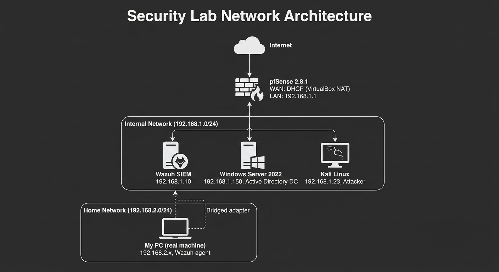
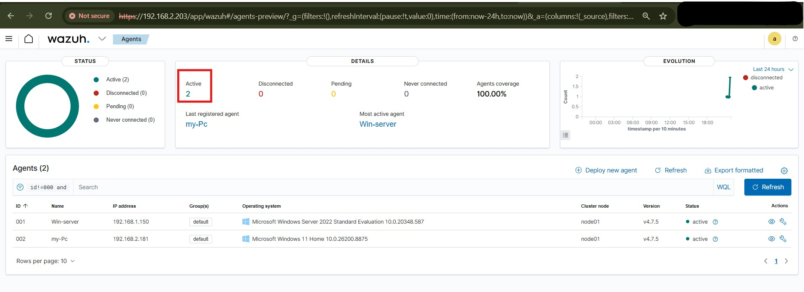
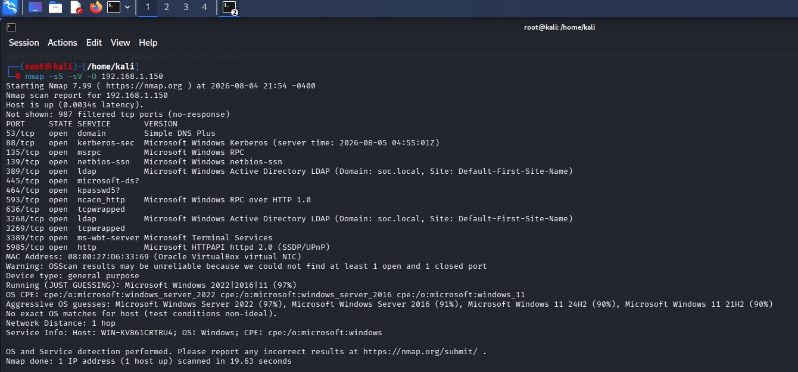
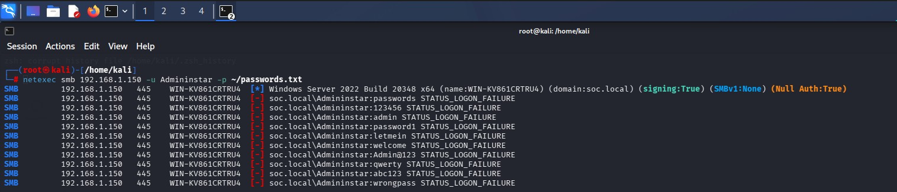
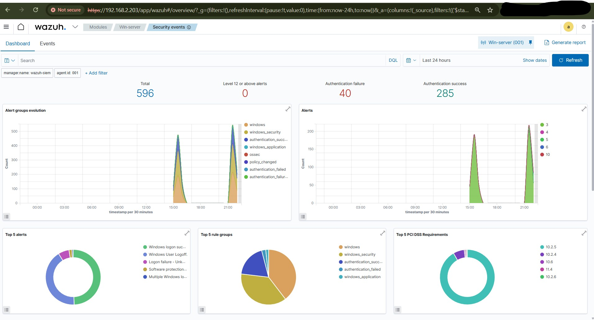
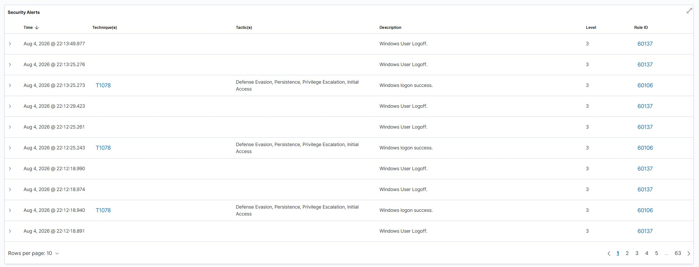
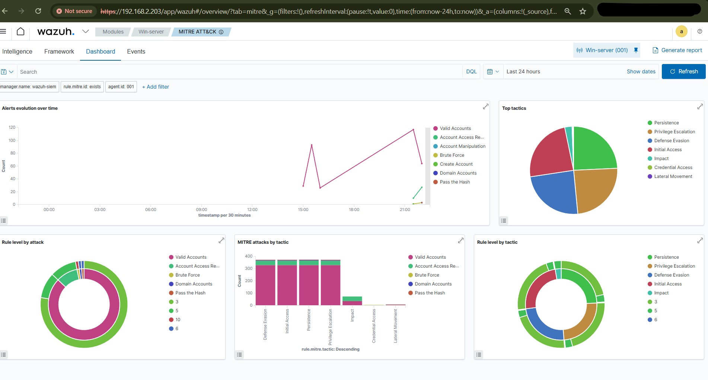
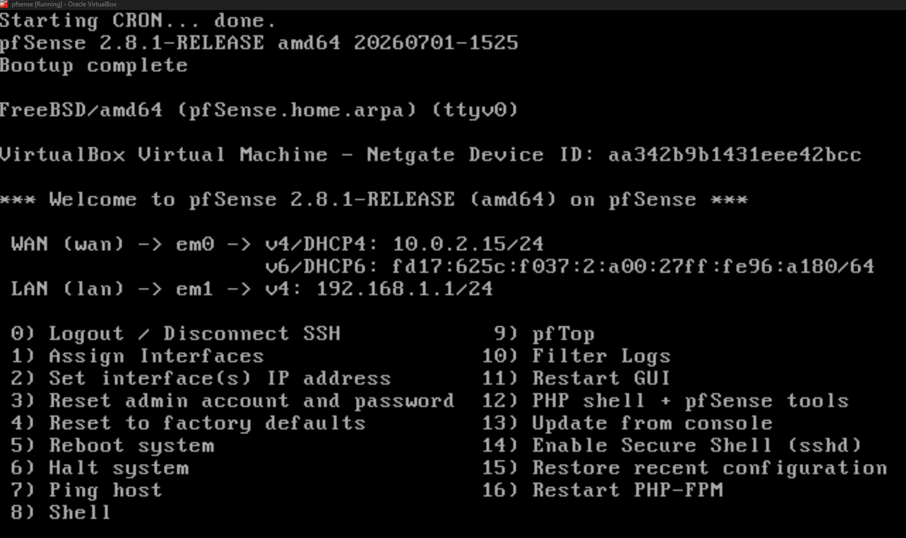

# 🔵 SOC Home Lab

## 📋 Overview
A fully functional Security Operations Center (SOC) home lab built from scratch using VirtualBox. Designed to simulate a real enterprise environment for practicing threat detection, attack simulation, and incident response.

---

## 🖧 Network Topology

| Machine | Role | IP Address |
|---|---|---|
| pfSense 2.8.1 | Firewall / Gateway | 192.168.1.1 (LAN), DHCP (WAN) |
| Wazuh SIEM | Security Monitoring | 192.168.1.10 |
| Windows Server 2022 | Active Directory DC | 192.168.1.150 |
| Kali Linux | Attack Simulation | 192.168.1.23 |
| My PC (real machine) | Monitored Endpoint | 192.168.2.x, bridged network |

---

## 🛠️ Tools Used

- **VirtualBox** — Hypervisor
- **pfSense 2.8.1** — Firewall and network gateway
- **Wazuh 4.7.5** — SIEM, EDR, and log management
- **Sysmon** — Endpoint telemetry (SwiftOnSecurity config)
- **Windows Server 2022** — Active Directory (soc.local)
- **Kali Linux** — Attack simulation
- **Nmap** — Network reconnaissance
- **NetExec** — SMB credential testing

---

## 🏗️ What I Built

- Configured **pfSense** as perimeter firewall with WAN/LAN separation and internal routing
- Deployed **Wazuh SIEM** with Indexer, Manager, and Dashboard components on Ubuntu Server
- Built **Active Directory** domain (soc.local) with Windows Server 2022 domain controller
- Installed **Sysmon** on all Windows endpoints using SwiftOnSecurity ruleset for rich telemetry
- Connected a real machine to the lab via a **bridged adapter**, achieving 100% agent coverage across both internal and home networks
- Simulated real attacks and detected them in real time via the Wazuh dashboard

---

## 👥 Active Agents

---

## ⚔️ Attack Simulations

### Attack 1 — Network Reconnaissance
| | |
|---|---|
| **Tool** | Nmap 7.99 |
| **Command** | `nmap -sS -sV -O 192.168.1.150` |
| **MITRE ATT&CK** | T1046 — Network Service Discovery |
| **Result** | Open ports discovered, OS fingerprinted (Windows Server 2022, 97% confidence) |

### Attack 2 — SMB Brute Force
| | |
|---|---|
| **Tool** | NetExec |
| **Target** | soc.local\Administrator via SMB port 445 |
| **MITRE ATT&CK** | T1110 — Brute Force |
| **Result** | 10 password attempts, 0 credentials obtained |

---

## 📊 Wazuh Dashboard

Latest capture shows 596 total alerts over 24 hours, with 40 authentication failures and 285 authentication successes detected during active testing.

---

## 🎯 MITRE ATT&CK Mapping

Wazuh automatically mapped detected activity to multiple MITRE ATT&CK tactics, including Initial Access, Persistence, Privilege Escalation, Defense Evasion, Credential Access, and Lateral Movement.

---

## 🔥 pfSense Configuration

---

## 🎯 Skills Demonstrated

- Network architecture and segmentation
- SIEM deployment and configuration
- Endpoint detection and response (EDR)
- Active Directory administration
- Attack simulation and threat detection
- MITRE ATT&CK framework mapping
- Incident documentation and reporting

---

## 📚 References

- [Wazuh Documentation](https://documentation.wazuh.com)
- [MITRE ATT&CK Framework](https://attack.mitre.org)
- [SwiftOnSecurity Sysmon Config](https://github.com/SwiftOnSecurity/sysmon-config)
